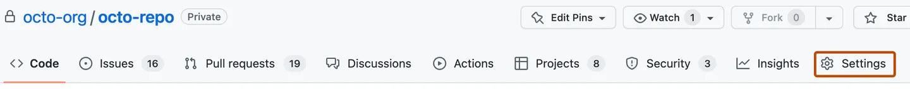
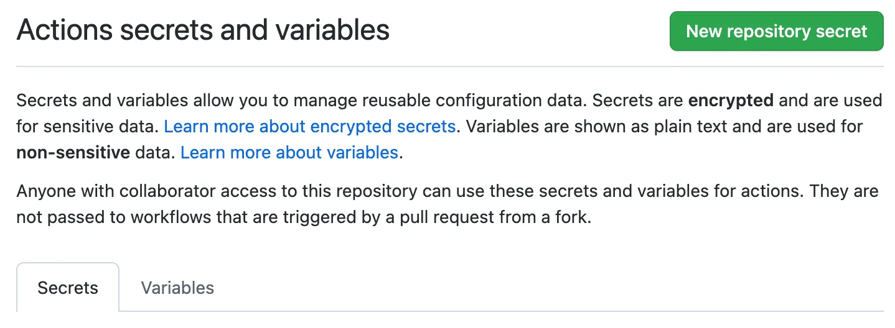

# Creating secrets for a repository
To create secrets or variables on GitHub for a personal account repository, you must be the repository owner. To create secrets or variables on GitHub for an organization repository, you must have admin access. Lastly, to create secrets or variables for a personal account repository or an organization repository through the REST API, you must have collaborator access.

1. On GitHub.com, navigate to the main page of the repository.
2. Under your repository name, click  **Settings**. If you cannot see the "Settings" tab, select the  dropdown menu, then click **Settings**.

3. In the "Security" section of the sidebar, select  **Secrets and variables**, then click **Actions**.
4. Click the **Secrets** tab.

5. Click **New repository secret**.
6. In the **Name** field, type a name for your secret.
7. In the **Secret** field, enter the value for your secret.
8. Click **Add secret**.
If your repository has environment secrets or can access secrets from the parent organization, then those secrets are also listed on this page.